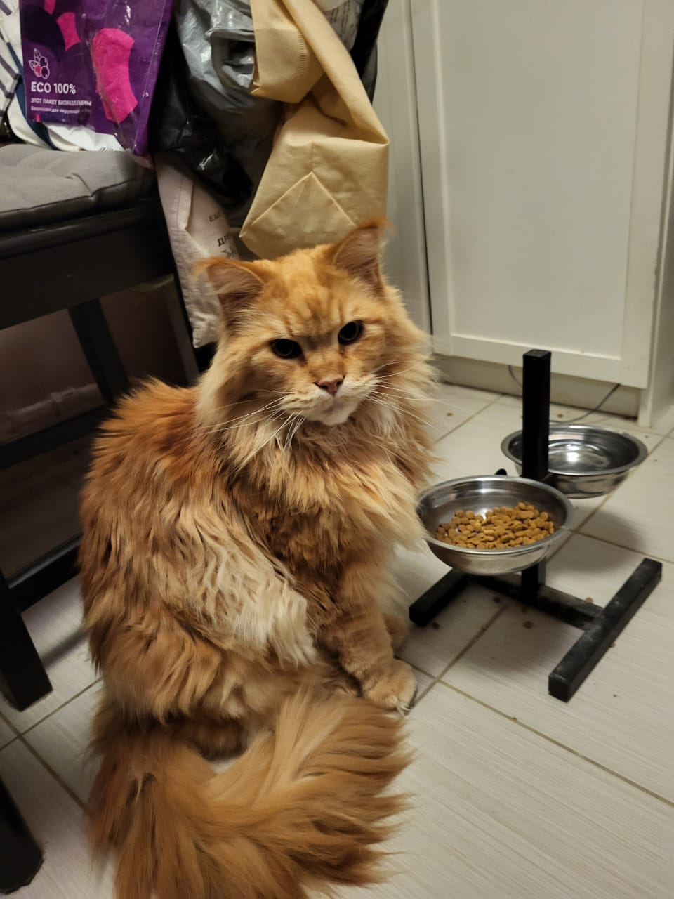

# Обо мне

Здравствуйте. Меня зовут Марина, и Вы находитесь на этой странице, потому что мне нужно сдать домашнее задание. Пожалуй, это все важные сведения на данный момент.

## Некоторая текстовая информация обо мне

Настоящий текст призван продемонстрировать виртуозность владения Markdown. Факт того, что мне пришлось гуглить, как правильно пишется Markdown, это не самый сильный мой навык.

Я умею писать _курсивом_ или **жирным** шрифтом, а при особом желании выделиться из толпы - пишу ***жирным кусивом***.

Когда мне хочется выглядеть умной, я использую цитаты великих людей. Например:
>Чтобы выглядеть умнее, используй цитаты великих людей.
>
>**Джейсон Стетхем**.

Подлинность цитаты можно проверить [здесь](https://www.google.com/ "Восхитительное местечко этот гугл, я вам скажу").

Дальше было бы логичным продемонстрировать владение списками, но:
1. Я очень не люблю списки
2. С логикой у меня плохо

## Некоторая графическая информация обо мне

Не нашла своего фото, поэтому вот фото моего кота:

